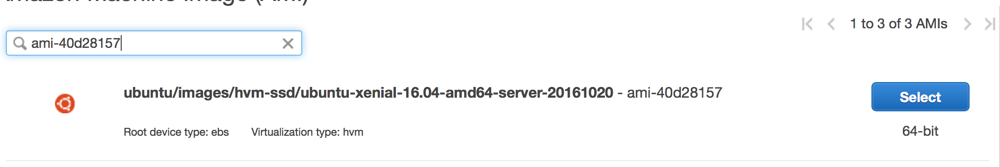
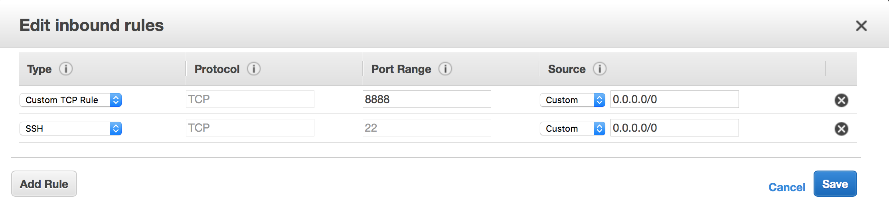

### Helpful Links
- [Mastering Markdown](https://guides.github.com/features/mastering-markdown/)
- [CUDA 7.5 on AWS GPU Instance Running Ubuntu 14.04](http://tleyden.github.io/blog/2015/11/22/cuda-7-dot-5-on-aws-gpu-instance-running-ubuntu-14-dot-04/)
- [fbcunn - Deep Learning CUDA Extensions from Facebook AI Research](https://github.com/facebook/fbcunn)
- [fbcunn - Install.md](https://github.com/facebook/fbcunn/blob/master/INSTALL.md)
- [fbcunn - Install Script](https://raw.githubusercontent.com/soumith/fblualib/master/install_all.sh)
- [Multipathnet](https://github.com/facebookresearch/multipathnet)
- [Torch implementation of DeepMask and SharpMask](https://github.com/facebookresearch/deepmask)
- [unorganized notes on deepmask installation](https://gist.github.com/ryanfb/13bd5cf3d89d6b5e8acbd553256507f2)
- [Google Test, Google's C++ test framework](https://github.com/google/googletest/releases)
- [Zstandard - Fast real-time compression algorithm](https://github.com/facebook/zstd)
- [fblualib: A collection of Lua / Torch utilities](https://github.com/soumith/fblualib)


## 1- Launch an Amazon Machine Image (AMI)
From the Community AMIs, choose an 'ami-40d28157' image:

Choose an AMI with the following settings:
- g2.2xlarge
- 160 GB Storage size
- Tag: Ubunutu CUDA
- Open port 8888 for iTorch


## 2- Upgrade Ubuntu
```bash
sudo apt-get update
sudo apt-get upgrade
sudo apt-get dist-upgrade
sudo apt-get autoremove
sudo apt-get clean
lsb_release -a # Checking Ubuntu version
# Serch for a file: sudo find ./ | grep libgflags.so.2.2
mkdir libraries
```

## 3- Install CUDA
```bash
sudo apt-get install build-essential
sudo apt-get update
sudo apt-get install linux-generic
cd libraries
wget http://developer.download.nvidia.com/compute/cuda/8.0/secure/prod/local_installers/cuda-repo-ubuntu1604-8-0-local_8.0.44-1_amd64.deb?autho=1480958229_4b8c499246aee91d79902c51009ea47b&file=cuda-repo-ubuntu1604-8-0-local_8.0.44-1_amd64.deb
sudo dpkg -i cuda-repo-ubuntu1604-8-0-local_8.0.44-1_amd64.deb
sudo apt-get update
sudo apt-get install cuda
echo "export PATH=/usr/local/cuda/bin/:\$PATH; export LD_LIBRARY_PATH=/usr/local/cuda/lib64/:\$LD_LIBRARY_PATH; " >>~/.bashrc && source ~/.bashrc
rm cuda-repo-ubuntu1604-8-0-local_8.0.44-1_amd64.deb
```
Reboot the machine and verify that CUDA is running
```bash
nvidia-smi 
lsmod | grep -i nvidia
ls -alh /dev | grep -i nvidia
```

## 4- Install CUDNN
Go to [CUDNN](https://developer.nvidia.com/cuDNN) and download cuDNN for Linux. 
```bash
cd libraries
wget http://developer.download.nvidia.com/compute/machine-learning/cudnn/secure/v5.1/prod/8.0/cudnn-8.0-linux-x64-v5.1.tgz?autho=1480818585_1a8ff8e74ddf3f6a9f71662f7d51e1ea&file=cudnn-8.0-linux-x64-v5.1.tgz
tar -xvf cudnn-8.0-linux-x64-v5.1.tgz 
sudo cp cuda/include/*.h /usr/local/cuda/include
sudo cp cuda/lib64/*.so* /usr/local/cuda/lib64
rm cudnn-8.0-linux-x64-v5.1.tgz 
```

## 5- Install Torch
Install Torch Dependencies
```bash
curl -sk https://raw.githubusercontent.com/torch/ezinstall/master/install-deps | bash -e
```
Install Torch
```bash
git clone https://github.com/torch/distro.git ~/torch --recursive
cd ~/torch
bash install-deps
./install.sh
source ~/.bashrc
```

## 6- Install Folly
Install required packages
```bash
sudo apt-get install -y \
    git \
    curl \
    wget \
    g++ \
    automake \
    autoconf \
    autoconf-archive \
    libtool \
    libboost-all-dev \
    libevent-dev \
    libdouble-conversion-dev \
    libgoogle-glog-dev \
    libgflags-dev \
    liblz4-dev \
    liblzma-dev \
    libsnappy-dev \
    make \
    zlib1g-dev \
    binutils-dev \
    libjemalloc-dev \
    libiberty-dev \
    flex \
    bison \
    libkrb5-dev \
    libsasl2-dev \
    libnuma-dev \
    pkg-config \
    libssl-dev \
    libedit-dev \
    libmatio-dev \
    libpython-dev \
    libpython3-dev \
    python-numpy
```
Install Google Test 1.7
```bash
cd ~/libraries
wget https://github.com/google/googletest/archive/release-1.7.0.zip
unzip release-1.7.0.zip
mv ./googletest-release-1.7.0/ ./gtest-1.7.0/
rm release-1.7.0.zip 
```
Download and Install Folly
```bash
cd ~/libraries
git clone https://github.com/facebook/folly.git
cd folly/folly/
autoreconf -ivf
./configure
cp -R ~/libraries/gtest-1.7.0/* ./test/gtest-1.7.0/
make
make check
sudo make install
sudo ldconfig # reload the lib paths after freshly installed folly. fbthrift needs it.
```

## 7- Install FBThrift
Install mstch library
```bash
cd ~/libraries
git clone https://github.com/no1msd/mstch.git
 cd mstch/
mkdir build
cd build
cmake ..
make
sudo make install
```
Install Wangle library
```bash
cd ~/libraries
git clone https://github.com/facebook/wangle
cd wangle/wangle
cmake .
make
ctest
sudo make install
sudo ldconfig # reload the lib paths after freshly installed wangle. fbthrift needs it.
```
Install FB Zstandard Library (zstd)
```bash
cd ~/libraries
git clone https://github.com/facebook/zstd.git
cd zstd
sudo make install # Might need to do cmake first
zstd --version # Check if zstd is working
```
Download and install FBThrift
```bash
cd ~/libraries
git clone https://github.com/facebook/fbthrift.git
cd fbthrift/thrift/
autoreconf -ivf 
./configure
make
sudo make install
mkdir ~/libraries/thrift_compiler
cp -a ./compiler/py ~/libraries/thrift_compiler
cd ~/libraries/thrift_compiler/py
sudo python setup.py install
cd ~/libraries
rm -rf ./thrift_compiler
```

## 8- Install TH++
```bash
cd ~/libraries
git clone https://github.com/facebook/thpp
cd thpp/thpp
vi ./CMakeLists.txt
```
Change the following in CMakeLists.txt:
```
SET(CMAKE_CXX_FLAGS "${CMAKE_CXX_FLAGS} -std=gnu++11")
```
into:
```
SET(CMAKE_CXX_FLAGS "${CMAKE_CXX_FLAGS} -std=gnu++14")
```
Also Comment the following code segment:
```
IF(NOT NO_TESTS) ENABLE_TESTING() FIND_PACKAGE(Glog REQUIRED) INCLUDE_DIRECTORIES(${GLOG_INCLUDE_DIR}) TARGET_LINK_LIBRARIES(thpp ${GLOG_LIBRARIES}) ADD_SUBDIRECTORY("googletest-release-1.7.0") INCLUDE_DIRECTORIES( "${CMAKE_CURRENT_SOURCE_DIR}/googletest-release-1.7.0/include" ) ADD_SUBDIRECTORY("test") ENDIF()
```
Finally, copile TH++
```bash
./build.sh
LD_LIBRARY_PATH=$LD_LIBRARY_PATH:/home/ubuntu/torch/install/lib
export LD_LIBRARY_PATH
echo $LD_LIBRARY_PATH # Should be: /usr/local/cuda/lib64/:/home/ubuntu/torch/install/lib:/home/ubuntu/torch/install
sudo ldconfig # reload the lib paths 
```

## 9- Install FBlualib
Not sure it is needed, as it seems to fail
```bash
cd ~/libraries
git clone https://github.com/soumith/fblualib.git
cd fblualib/fblualib
./build.sh
```

## 10- Insatll Luarocks libraries for multipath
```bash
luarocks install inn
luarocks install torchnet
luarocks install fbpython
luarocks install class
luarocks install optnet
```

## 11- Install COCO
```bash
git clone https://github.com/pdollar/coco
cd coco
luarocks make LuaAPI/rocks/coco-scm-1.rockspec
sudo apt-get install python-pip
sudo pip install --upgrade pip
sudo pip install Cython
cd PythonAPI
make
```

## 12- Install Multipath
```bash
cd ~
git clone https://github.com/facebookresearch/multipathnet.git
cd /tmp
wget http://mscoco.org/static/annotations/PASCAL_VOC.zip
wget http://mscoco.org/static/annotations/ILSVRC2014.zip
wget http://msvocds.blob.core.windows.net/annotations-1-0-3/instances_train-val2014.zip

export MPROOT=~/multipathnet
mkdir -p $MPROOT/data/annotations
cd $MPROOT/data/annotations
unzip -j /tmp/PASCAL_VOC.zip
unzip -j /tmp/ILSVRC2014.zip
unzip -j /tmp/instances_train-val2014.zip

mkdir -p $MPROOT/data/proposals/VOC2007/selective_search
cd $MPROOT/data/proposals/VOC2007/selective_search
wget https://s3.amazonaws.com/multipathnet/proposals/VOC2007/selective_search/train.t7
wget https://s3.amazonaws.com/multipathnet/proposals/VOC2007/selective_search/val.t7
wget https://s3.amazonaws.com/multipathnet/proposals/VOC2007/selective_search/trainval.t7
wget https://s3.amazonaws.com/multipathnet/proposals/VOC2007/selective_search/test.t7

mkdir -p $MPROOT/data/proposals/coco/sharpmask
cd $MPROOT/data/proposals/coco/sharpmask
wget https://s3.amazonaws.com/multipathnet/proposals/coco/sharpmask/train.t7
wget https://s3.amazonaws.com/multipathnet/proposals/coco/sharpmask/val.t7

mkdir -p $MPROOT/data/models
cd $MPROOT/data/models
wget https://s3.amazonaws.com/multipathnet/models/imagenet_pretrained_alexnet.t7
wget https://s3.amazonaws.com/multipathnet/models/imagenet_pretrained_vgg.t7
wget https://s3.amazonaws.com/multipathnet/models/vgg16_fast_rcnn_iter_40000.t7
wget https://s3.amazonaws.com/multipathnet/models/caffenet_fast_rcnn_iter_40000.t7

if [ ! -f ~/multipathnet/config.lua.backup ]; then
  cp ~/multipathnet/config.lua ~/multipathnet/config.lua.backup
fi

echo "
-- put your paths to VOC and COCO containing subfolders with images here
local VOCdevkit = '$MPROOT/data/proposals'
local coco_dir = '$MPROOT/data/proposals/coco'
return {
   pascal_train2007 = paths.concat(VOCdevkit, 'VOC2007/selective_search'),
   pascal_val2007 = paths.concat(VOCdevkit, 'VOC2007/selective_search'),
   pascal_test2007 = paths.concat(VOCdevkit, 'VOC2007/selective_search'),
   pascal_train2012 = paths.concat(VOCdevkit, 'VOC2007/selective_search'),
   pascal_val2012 = paths.concat(VOCdevkit, 'VOC2007/selective_search'),
   pascal_test2012 = paths.concat(VOCdevkit, 'VOC2007/selective_search'),
   coco_train2014 = paths.concat(coco_dir, 'sharpmask'),
   coco_val2014 = paths.concat(coco_dir, 'sharpmask'),
}" > ~/multipathnet/config.lua

cd $MPROOT
git clone https://github.com/facebookresearch/deepmask.git

cd $MPROOT/data/models
# download SharpMask based on ResNet-50
wget https://s3.amazonaws.com/deepmask/models/sharpmask/model.t7 -O sharpmask.t7
wget https://s3.amazonaws.com/multipathnet/models/resnet18_integral_coco.t7

export PYTHONPATH=~/libraries/coco/PythonAPI
# Test Multipath
cd $MPROOT
th demo.lua -img ./deepmask/data/testImage.jpg
```

## 13- Install Deepmask & Sharpmask
```bash
cd ~
DEEPMASK=~/deepmask
git clone https://github.com/facebookresearch/deepmask.git $DEEPMASK
# Download pre-trained DeepMask and SharpMask models:
mkdir -p $DEEPMASK/pretrained/deepmask; cd $DEEPMASK/pretrained/deepmask
wget https://s3.amazonaws.com/deepmask/models/deepmask/model.t7
mkdir -p $DEEPMASK/pretrained/sharpmask; cd $DEEPMASK/pretrained/sharpmask
wget https://s3.amazonaws.com/deepmask/models/sharpmask/model.t7
# Run computeProposals.lua with a given model and optional target image (specified via the -img option):
# apply to a default sample image (data/testImage.jpg)
cd $DEEPMASK
th computeProposals.lua $DEEPMASK/pretrained/deepmask # run DeepMask
th computeProposals.lua $DEEPMASK/pretrained/sharpmask # run SharpMask
#th computeProposals.lua $DEEPMASK/pretrained/sharpmask -img /path/to/image.jpg
```

## 14- Train your own model
### A) Preparation
Download the Torch ResNet-50 model pretrained on ImageNet:
```bash
mkdir -p $DEEPMASK/pretrained; cd $DEEPMASK/pretrained
wget https://s3.amazonaws.com/deepmask/models/resnet-50.t7
```
Download and extract the COCO images and annotations:
```bash
mkdir -p $DEEPMASK/data; cd $DEEPMASK/data
wget http://msvocds.blob.core.windows.net/annotations-1-0-3/instances_train-val2014.zip
wget http://msvocds.blob.core.windows.net/coco2014/train2014.zip
wget http://msvocds.blob.core.windows.net/coco2014/val2014.zip
unzip instances_train-val2014.zip > /dev/null 2>&1
unzip train2014.zip > /dev/null 2>&1
unzip val2014.zip > /dev/null 2>&1
rm instances_train-val2014.zip
rm train2014.zip
rm val2014.zip
```

### B) Training
To train, launch the train.lua script. It contains several options, to list them, simply use the --help flag:
To train DeepMask:
```bash
th train.lua
```
To train SharpMask (requires pre-trained DeepMask model):
```bash
th train.lua -dm /path/to/trained/deepmask/
```

